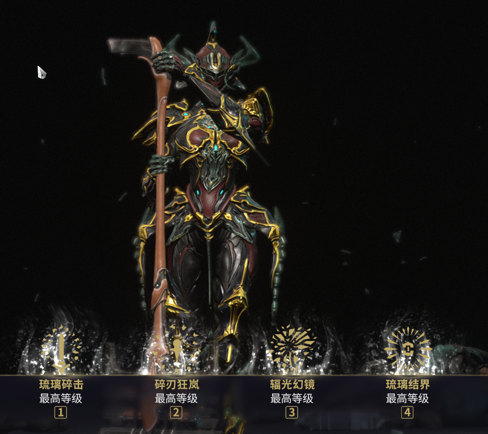

# 琉璃仕女（Gara）

## 概述

琉璃仕女（Gara），又称'**玻璃**'，主流玩法就是**主1的扫图**和**41联动的定点防御**

## 玩法介绍

---

### 主1扫图
+ 长按1，横扫是主要的输出手法。可以通过"选项" → "反转轻按/按住的技能"，将技能反转，此时短按1就是横扫。
+ 1技能命中敌人时，可以获得20连击，所以能轻松达到12×的连击倍率，让技能有12×的伤害。面对日常钢铁图，也不缺伤害。
+ 基础范围12m，对于扫图来说，也算比较好的。但是横扫只能扫面前的，而非是360°。
+ 优点：一击必杀的AOE技能，可穿墙。  缺点：只能横扫同一水平面

对比：
目前扫图，最好的3挡是：
1. 高斯拍手
2. 毒妈+AOE武器（推荐葬铭）
3. 琉璃1
> 高斯拍手可以说是扫图最效率的玩法，360° + 穿墙的AOE。但是长短按技能来打伤害，这个操作太反人类了，导致没宏上手会较难。其次就是高斯面对高血量怪会比较乏力，比如低语和1999。  
> 毒妈+AOE武器，因为是武器来打输出，所以不能穿墙是一个缺点。不过由于毒妈的高额增伤，所以在面对高血量怪时，会比较轻松。  
> 琉璃1就是上两者的折中，比高斯更高的伤害，比毒妈多个穿墙。缺点就是只能打同一水平面+非360°AOE。但是高额的伤害，面对日常最肉的低语和1999时，也能一击必杀，对于扫图来说，也算比较少见的了，所以优点是远大于缺点的。  

### 41定点防御
这版本没测，测了以后再更新