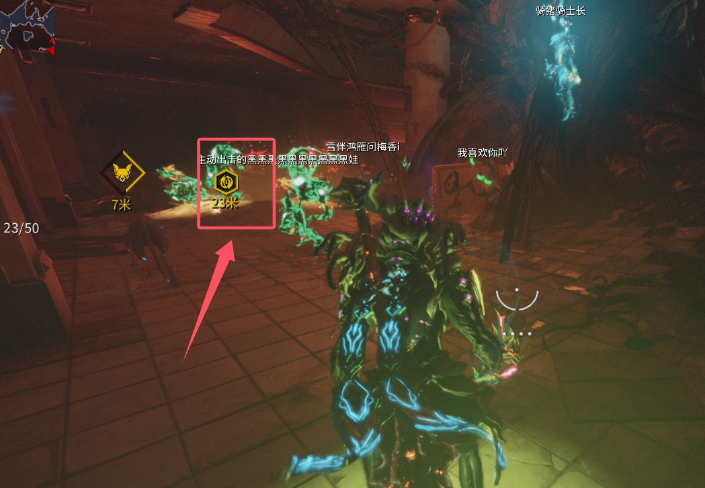

# 赤毒、信条、终幕

## 赤毒
待更新

## 信条
待更新

## 终幕
+ 视频攻略：

  

    

<iframe src="//player.bilibili.com/player.html?isOutside=true&aid=114187829320410&bvid=BV1RSQRYUEBX&cid=28946992511&p=1" style="position: absolute; top: 0; left: 0; width: 100%; height: 100%;"  scrolling="no" border="0" frameborder="no" framespacing="0" allowfullscreen="true"></iframe>
    

  

+ 文字步骤：
  + **一阶段**
    1. 购买一套杀毒Mod作为启动项（不买也行，可以通过赏金刷。购买渠道：交易频道、交易市场、~~商城~~）
    2. 接1999的杀毒赏金任务（奖励是杀毒Mod的那个赏金，虽然普通图也能打做流程，但还是推荐做赏金）
    3. 捡取混音带（黄标显示），捡了之后去破解电脑，破解完之后你就有骸子了。（击杀敌人掉落代币，混音带和电脑都会有**黄标**指引） 
  + **二阶段**
    1. 在灭骸之刃上安装杀毒Mod，与玄骸、信条不同，这个骸子只需要对应的**1个**杀毒Mod即可
    2. 找到对应的杀毒Mod后，需要将**杀毒进度**升到100%才能去决战（效价Mod可以提升这个进度）
    > 灭骸之刃  
    > ① 首先上3个杀毒Mod，找到对应的杀毒Mod。  
    > ② 找到之后，上1杀毒Mod+2效价Mod  
  + **三阶段**
    1. 最终决战不介绍了，全程都有标记指引。
    2. 完成决战会给你**活体心肌细胞**
  + **四阶段**  
    最后就是在埃莉诺兑换**终幕武器**即可

