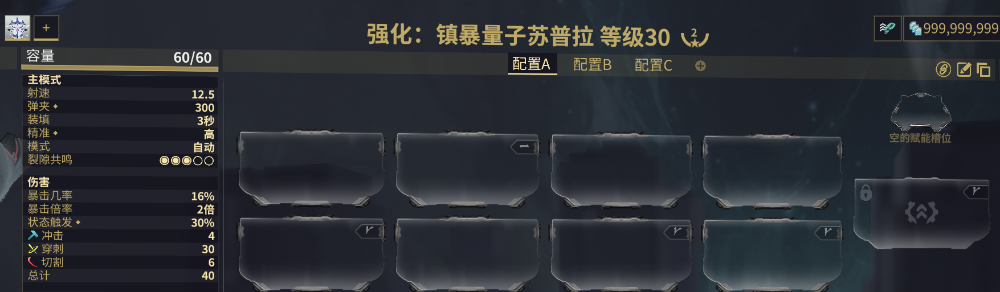
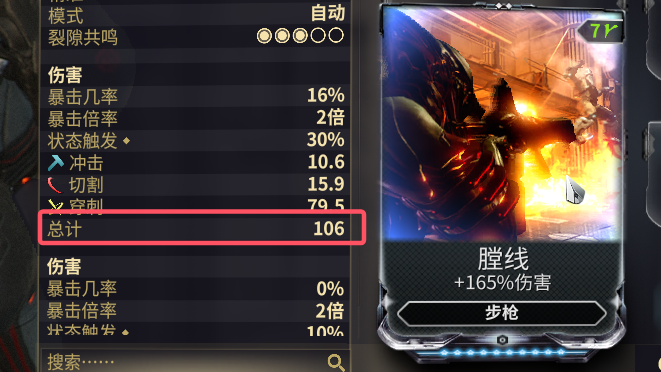
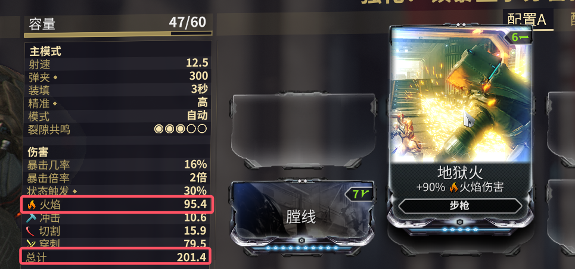
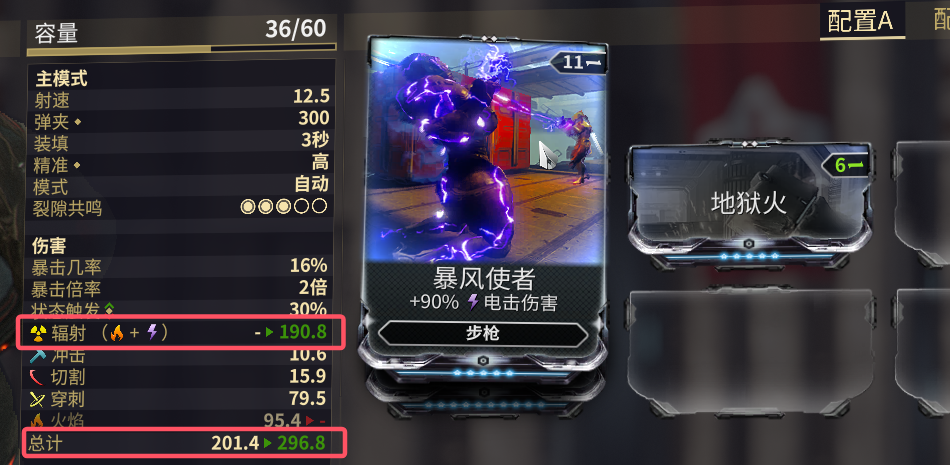
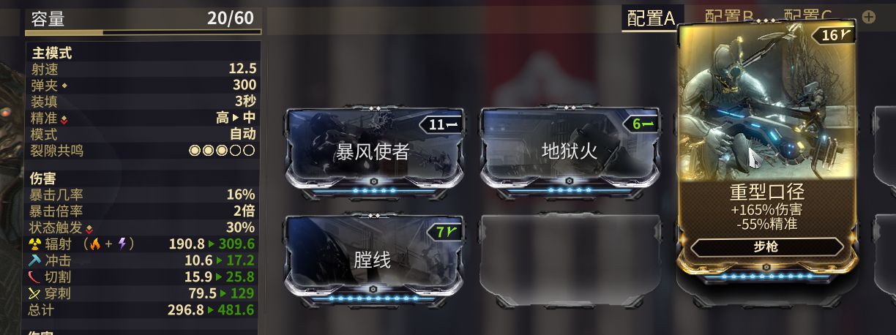

# 伤害计算
对目标造成的伤害，是经过各种加成得来的，这期文章从简单的武器伤害加成开始入门。

这里先讲实际例子，最后作出总结，方便理解

## 苏普拉例子

这期文章只用到以下信息，且80%的内容只用初始面板40

| 初始面板 | 冲击 | 穿刺 | 切割 |
| :------: | :--: | :--: | :--: |
|    40    |  4   |  30  |  6   |

:::tip
初始面板指没有任何加成的面板。这里可以简单的认为是没上Mod的面板
:::

:::details 拓展
Q: **赤毒**、**信条**以及**灵化**的加成，是否影响初始面板？  
A: 以下回答需要知道伤害计算的基础才听得懂。  
+ 先给答案，都不影响，初始面板在计算时只是一个普通的因子。但是从计算的层面上来说，**灵化**加成可以认为是影响的。
+ 首先**赤毒**、**信条**都是一个百分比，比如：25%，40%，60%。以苏普拉为例，计算时，能直接计算，$40 \cdot (1+60\%) = 64$  
+ **灵化**则是给的一个具体的数字，比如圣装拉特龙，初始面板是**90**，第2个灵化词条是**伤害+6**，这里就可以认为是影响，就$90 + 6 = 96$。
+ 寻求这类问题的答案，终其一切都是为了伤害计算服务的。比如讨论刚刚这个是否影响，最根本的问题就是这个加成是该'+'还是'×'，该'+'在哪，或者'×'在哪。  
所以影响也好，不影响也好。只要能明白怎么'+'，怎么'×'就行。
:::

:::warning
紫卡上经常会有人说，“负物理影响初始面板”。这是错的，虽然这句话说得很模糊，但是如果有人说了这句话，那么他想表达的意思就是错的。
:::

### 1. 膛线

言归正传，我们上一张【膛线】，效果：**+165%的伤害**  
那么此时面板就是 
$$
\begin{gather*}
40 \cdot (1+165\%) = 106
\end{gather*}
$$ 

:::tip
+ 这里为什么是$40 \cdot (1+165\%)$，1是哪里来的？
+ 因为这个165%是额外增加的，$40+40 \cdot 165\% = 40 \cdot (1+165\%)$。想想3的2倍，和3增加2倍。以前学的知识，倍数都是整数，这里可能就容易忽略。
:::

### 2. 膛线+地狱火

这时，我们再上一个【地狱火】，效果：**+90%的火焰伤害**
$$
\begin{gather*}
\text{额外增加的\textbf{火焰伤害}}：106 \cdot 90\% = 95.4 \\
\text{总计}：106 \cdot (1+90\%) = 201.4
\end{gather*}
$$ 

### 3. 膛线+地狱火+暴风使者

又上一个【暴风使者】，效果：**+90%的电击伤害**  
:::tip
+ 可以看到面板上的**火焰**伤害变成0，然后也没有**电击**伤害，而且多出了一个**辐射**伤害。这涉及到**元素复合**的概念，这里就不详细介绍了。  
+ 元素复合：元素分为**单元素**和**复合元素**，2个单元素可以组成特定的复合元素。  
+ 这里就是**电**+**火**=**辐射**
:::

90%**电击**跟90%**火焰**是同类加成，所以这2个加成会先相加，90%+90%=180%      
$$
\begin{gather*}
\text{额外增加的\textbf{辐射伤害}}：106 \cdot 180\% = 190.8 \\
\text{总计}：106 \cdot (1+90\%+90\%) = 296.8
\end{gather*}
$$ 

:::tip
Q：如何判断**同类加成**？  
A：1.这个除了一些众所周知的，一般都是需要自己去推测算式，然后再去实际打伤害，看造成的伤害是否与自己推测的理论伤害相符。  
2.即使是同一个加成，在不同的环境（比如：武器）可能也会有不同的计算。所以在遇到不同的看法时，也要保持理性的判断。
:::

### 4. 膛线+地狱火+暴风使者+重型口径

最后一个例子，上一个【重型口径】，效果：**+165%伤害**
+ 同类①：【膛线】+【重口】    165%+165% = 330%
+ 同类②：【地狱火】+【暴风使者】    90%+90% = 180%

$$
\begin{gather*}
\text{总计}：40 \cdot (1+165\%+165\%) \cdot (1+90\%+90\%) = 481.6
\end{gather*}
$$ 

## 总结
综上，伤害计算就是普通的加减乘除。更简单的说，就是多个因子做乘法，只是在相乘时，需要判断，哪些因子是同类的，需要先相加，再做之后的计算。
