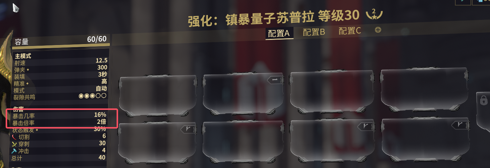
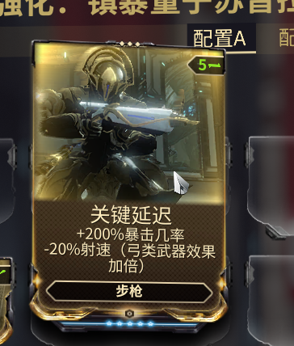
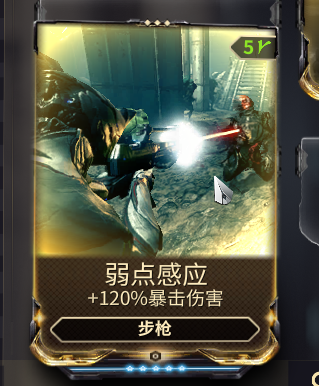
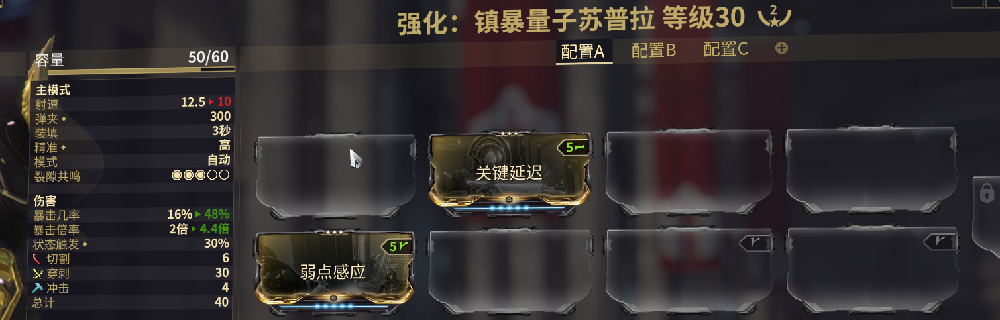

# 暴击

暴击：使武器有**概率**造成**其他倍数**的伤害
  + **概率**：暴击几率
  + **其他倍数**：暴击倍率

---

## 基础

+ **暴击几率**：16%
+ **暴击倍率**：2倍  
有 **16\%** 的概率造成 **2倍** 的伤害，暴击后的伤害就是  40 × 2 = 80 。

:::tip
鼠标悬停在红色下划线的内容会有详细说明
:::

  
此时我们上2个Mod，算法回顾[上一节内容](01-DMG.md)，可以很轻松得到：
+ **暴击几率**：16% × (1 + 200%) = 48%
+ **暴击倍率**：2 × (1 + 120%) = 4.4  
那么此时就有 **48\%** 的概率造成 **4.4倍** 的伤害，暴击后的伤害就是  40 × 4.4 = 176 。

## 进阶

### 暴击等级
