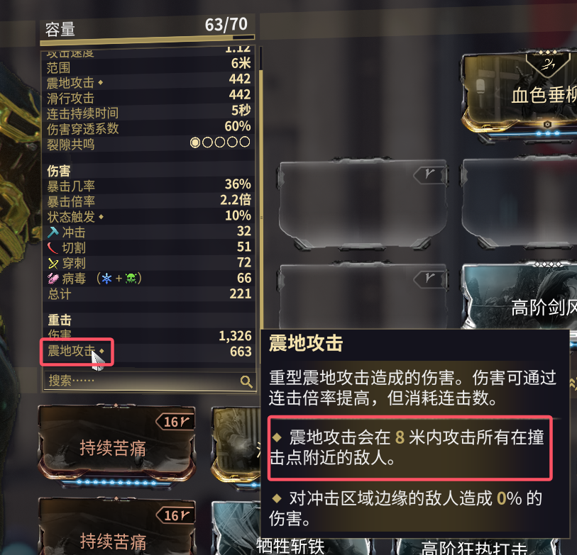

# 
震地

&emsp;&emsp;经过[U35.5](https://forums.warframe.com/topic/1388638-pc-update-355-dante-unbound/)更新后，修改了震地加成方式，成为了现如今非常火热的扫图玩法。\
&emsp;&emsp;轻击震地为2×倍率，重击震地为3×倍率，震地的范围也会在面板上显示。

+ BUG
  + 蛇主套加成应用2次：
$(1+基伤+蛇主) \cdot (1+震波+蛇主)$  

## 武器选择

